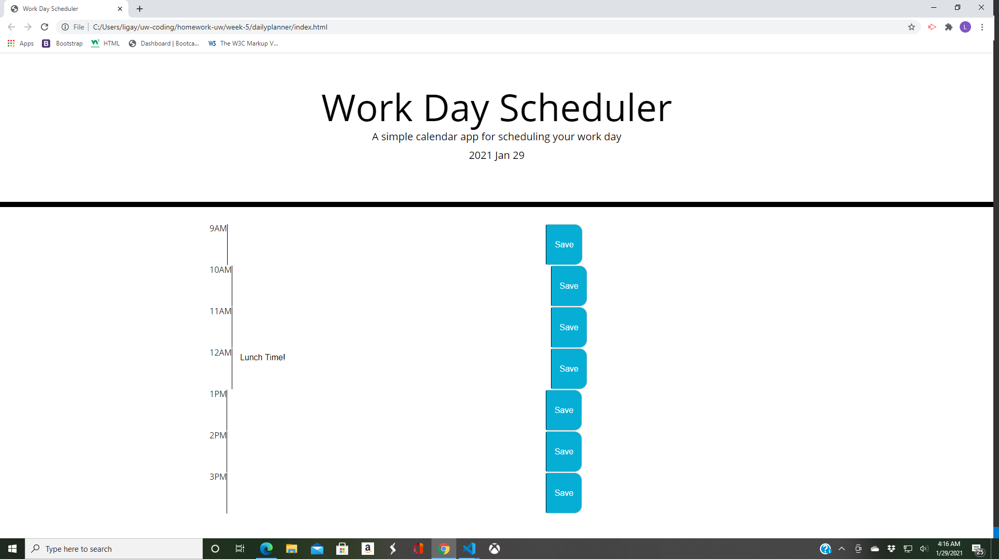

# Daily-WorkPlanner
This week homework we had to make an daily work schedule, using JQUERY. The daily scheduler being able to save daily to-dos and with refreshing the page, the to-dos do not leave the page. The scheduler is an hourly planner, from 9 am to 5pm. 

## screenshot
 alt = "screenshot of my planner"